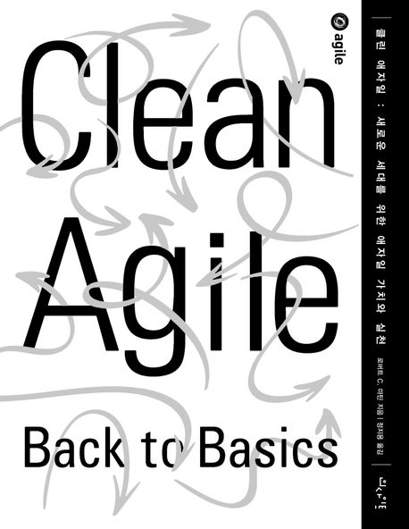

# Clean_Agile

## 소개

로버트 C. 마틴 아죠시가 쓴 [클린 애자일(인사이트)](https://www.yes24.com/Product/Goods/95728889)책을 읽고 소감을 나누는 북 스터디.

### 기간

|순서|제목|발표일|
|---|---|---|
|1|[애자일 소개](/ch01/ch01.md)|23.07.12|
|2|[왜 애자일인가](/ch02/ch02.md)|23.07.19|
|3|[비즈니스 실천 방법](/ch03/ch03.md)|23.07.26|
|4|[팀 실천 방법](/ch04/ch04.md)|23.08.02|
|5|[기술 실천 방법](/ch05/ch05.md)|23.08.09|
|6|애자일해지기||
|7|장인정신||
|8|결론||