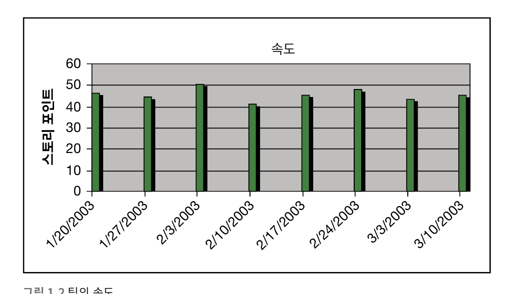
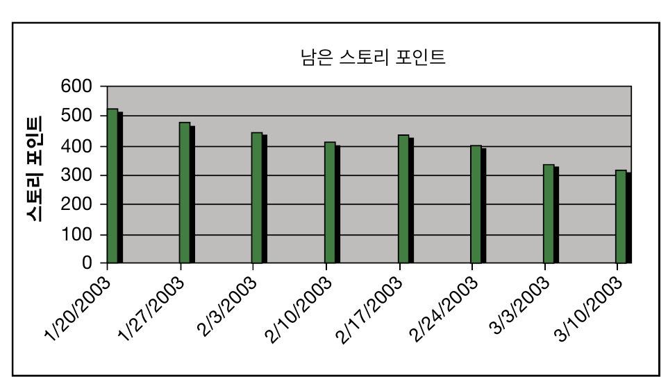
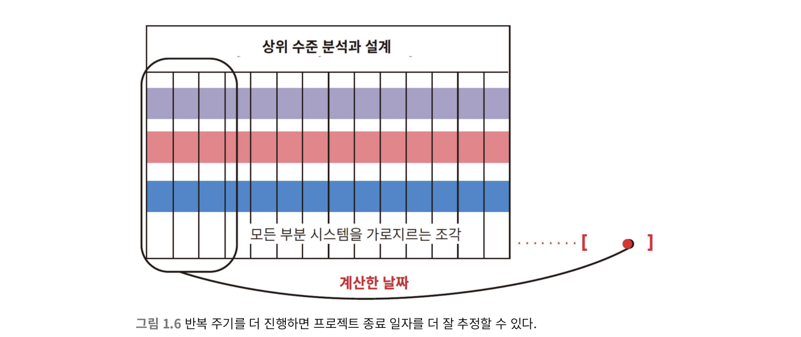
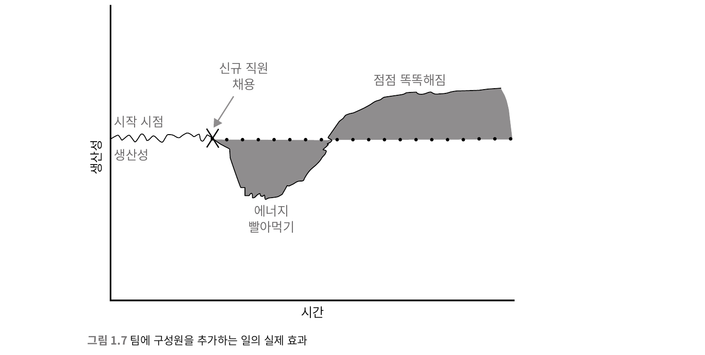
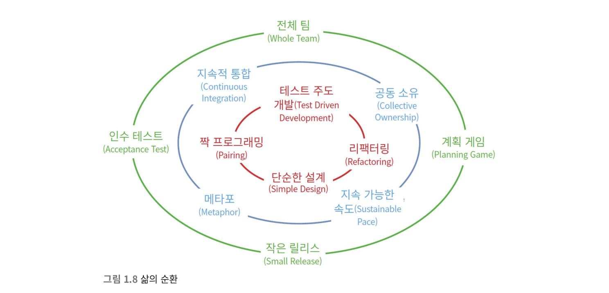

# 1장. 애자일 소개

## 애자일의 역사

* 애자일 기법은 새로운것이 아니다. 공동체가 형성되고, 그들이 협력을 시작하는 시점부터.. 즉, 선사시대부터 시작되었을수도 있을만한, 직관적이고 본능적인 협업 프로세스이다.
* 1970년 대규모 프로젝트를 관리하는 방법에 대한 논문이 나왔는데. (윈스턴 로이스) 그가 그린 폭포수 그림이 너무나도 인상적이어서 폭포수(Waterfall)개발이 소프트웨어 산업 전반에 자리잡은 것 같다.
	* 하지만 폭포수는.. 특히 소프트웨어 개발의 구현과 설계에서 실패할 확률이 높다.
	* 하지만 폭포수 개발의 파급효과는 엄청나서, 프로그래밍 패러다임마다 분석 - 설계 - 개발이 세트가 되어 발표되는 경향이 생겼다.
	* 특히, 객체지향개발과 폭포수 모델이 잘 맞지 않는다는 생각이 들었다.
* 개발 프로세스 경량화에 대한 욕구가 생겼고, 이에대한 의견을 나누기 위한 회의가 열렸다.

## 스노버드

* 17명의 개발자들이 참여하여 개발 프로세스 경량화에 대한 의견을 나눔.
* 가장 중요한 네가지 가치를 정했는데.
	* 공정과 도구보다는, **개인과의 상호작용**
	* 포괄적인 문서보다는, **작동하는 소프트웨어**
	* 계약 협상보다는, **고객과의 협력**
	* 계획을 따르기보다는, **변화에 대응**
* 이름에 대해서도 많이 고민했고(경량, 적응등), 결국 **애자일**이 채택되었음.

## 애자일 개요

### 관리의 철십자
* 프로젝트는 **관리의 철십자**라고 불리는 물리법칙에서 벗어날수가 없는데..
  * 좋음, 빠름, 저렴함, 완성
  * 이중 세가지만 고를 수 있다.

### 벽에 걸린 차트




* 애자일 개발팀은 위 차트처럼 관리자가 좋은 결정을 내리는데 필요한 데이터를 생산하며, 이를 공개한다.
* 작업 단위를 잘게 쪼개서 포인트를 잡고, 그걸 처리한 속도를 기록하여 일정을 예측한다.

### 폭포수의 안좋은점을 예시로 든 시나리오

* 6개월짜리 프로젝트의 리뷰 회의를 진행한다.
* 분석 - 설계 - 구현의 룰을 따르며 일정을 잡는다.
* 분석
  * 리뷰회의이므로 요구사항이 없을수도, 정확하지 않을수도 있지만. 2개월로 일정을 잡는다.
  * 정확한 요구사항이 정립되지 않았지만, 일정을 회의에서 잡았으니 일단 그냥 하는데까지는 한다.
  * 분석이 정확하게 이루어지지 않았지만, 일정이 넘어갔으므로 설계로 넘긴다.
* 설계
  * 새로운 기능이 추가되고 기존기능은 변경된다. 그래서 다시 분석하고싶지만 시간이 모자라므로 설계단계에서 잘 메꿔본다.
  * 시간이 모자라면 넘긴다.
* 구현
  * 이건 못넘긴다.. (큰일남;; )
  * 어영부영 넘겨버린 분석과 설계가 일종의 리볼빙이 되어 도저히 일정을 맞출수가 없다.
  * 그래서 일정을 더 늘린다
  * 욕먹는다
  * 크런치모드에 돌입한다

`책에서는 매 단계를 넘길때마다 축하파티를 한다고 하던데.. 저자가 살짝 오바하는 경향이 있긴 하다`

### 애자일하게 해본다면?



* 물론 애자일도 틀은 크게 바뀌지 않는다.
* 프로젝트를 계속해서 작은 단위로 나눈다
  * 이것을 **반복주기** 또는 **스프린트** 라고 부른다
  * 길이는 보통 1~2주로 잡는다
* 반복주기 0
  * 짧게 기능 목록을 만드는데, 이를 **스토리**라고 부른다.
  * 개발 환경을 준비하고, 스토리의 크기를 추산하고, 최초의 계획을 세운다.
  * 스토리 목록(기능 목록)을 바탕으로 초기 시스템 설계의 밑그림을 그린다.
* 이후 반복주기
  * 반복주기가 끝날때마다, 스토리의 일부가 완료되었을것이다.
  * 이를 통해 반복주기 단위마다 얼마나 스토리를 마무리했는지 확인하여 그 **데이터**를 얻는다.
    * 물론, 첫 반복주기때의 데이터는 오차범위가 상당히 크다
  * 반복주기가 거듭될수록 그 데이터의 가치는 정확도가 올라간다.
  * 점점 정확해지는 데이터를 기반으로 조금 더 정확한 일정을 예측하고, 프로젝트를 관리할 수 있게 된다.

### 철십자 관리

* 완성을 포기할수는 없으니, 속도, 품질, 범위중 하나를 포기해야한다.
* 추가 인력 투입 (속도 증대)
  * 
  * 브룩스의 법칙에 따르면, 지연된 프로젝트에 인력을 추가하면 더 늘어진다.
  * 추가된 인력이 프로젝트를 파악하기까지 주변 동료들의 지원이 필요하기 때문이다.
* 품질 떨어뜨리기
  * 품질을 떨어뜨리는건 되도록 지양해야한다
* 범위 변경
  * 꼭 필요한 기능인지를 체크한다
  * 당연히 다 필요해보이지만, 하나하나 짚어보다보면 필요없는 기능이 존재할 확률은 매우 높다 (비즈니스의 가치를 잘 따져보아야 한다.)

## 삶의 순환

```
XP: eXtreme Programming의 약자로, 아래와 같은 의미를 가지고 있다.

* xp는 수시로 발생하는 고객의 요구사항에 유연하게 대응하기 위해 고객의 참여와 개발 과정의 반복을 극대화하여 개발 생산성을 향상시키는 방법
* 짧고 반복적인 개발주기, 단순한 설계, 고객의 적극적인 참여를 통해 소프트웨어를 빠르게 개발하는 것을 목적으로 함
* 릴리즈의 기간을 짧게 반복하면서 고객의 요구사항 반영에 대한 가시성을 높임
```



* 이 그림이 **삶의 순환**이라는 애칭으로 불림.