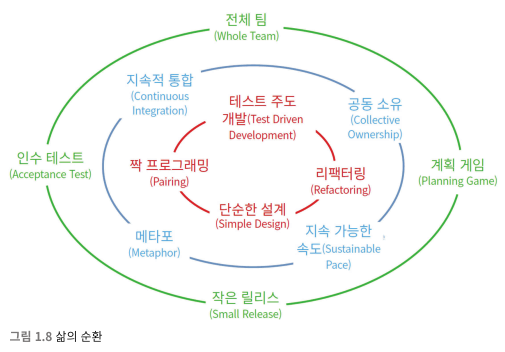

# 비즈니스 실천 방법



삶의 순환에서 가장 바깥고리인, 외부와의 연결부분.. 그 방법들에 대해 다룬다.

## 계획 세우기

프로젝트를 추정하려면 결국 프로젝트를 최대한 작은 단위로쪼개야 한다.

### 삼변량 분석(trivariate estimation)

* 최선, 일반, 최악의 경우를 두고 추정하는 방법
* 전체 프로젝트를 추정하기엔 적당하지만, 단일 프로젝트에서 일상적으로 사용하기에는 정밀도가 떨어진다.

### 스토리와 포인트

실제 결과를 바탕으로 추정치를 매번 재조정하여 더 확실하고 정밀하게 추정하는 방법.
처음에는 결과가 엉성하지만, 반복을 거듭할수록 정밀도가 올라간다.
초기에는 세부사항을 정하기에는 이르기 때문에 최대한 단순하게 정의하고, 이후에 처리를 한다.

#### 스토리 추정하기

추정회의때 포인트를 정한다.
중간정도의 공수가 들것을 예상해 하나 고른 후, 나머지 스토리들도 그것을 기반으로 포인트를 매긴다.

포인트는 그냥 노력의 가치일뿐, 실제 시간이 아니다.

#### 반복주기 1 계획하기

반복주기 계획 회의로 시작한다. 전체 반복주기 길이의 1/20정도가 좋다.
2주단위의 반복 주기라면, 하루 업무시간의 절반 (10일일때, 0.5일)정도를 계획에 할애하는것이 좋다.

팀 전원이 참석하여, 투자 수익률 사분면을 놓고 고민한다.

고가치이면서, 비용이 낮은것을 먼저 처리한다.

| |고비용|저비용|
|---|---|---|
|가치 높음|나중에 하자|지금 하자|
|가치 낮음|하지 말자|한참 나중에 하자|

반복주기마다 처리 가능한 포인트만큼 스토리를 골라서 처리를 한다.

#### 중간 확인

절반의 시간이 지났다면, 절반만큼의 스토리가 진행이 되어있어야 한다.
중간 검토회의에 참여하여 절반만큼의 포인트가 밀어져있나 체크한후, 그렇지 않다면 조정한다.

반복주기가 끝났을때, 예상 포인트만큼 스토리를 진행했는가 확인해보고, 그렇지 않다면 조정한다. 절대로 잘못된게 아니다.

#### 어제의 날씨

저번 반복주기때 예상한만큼의 포인트를 토대로 스토리 진행을 못했다면,
저번 반복주기를 토대로 다시한번 계산하여 새로운 반복주기에 할당한다.

#### 프로젝트 종료

프로젝트는 모든 스토리를 구현함으로서 끝내는것이 아니다.
남은 스토리들중 구현할 가치가 있는 스토리가 없을때 끝난다.

#### 스토리

* I: 독립적인(Independent)
  * 스토리는 독립적이어야해서, 최대한 의존성을 줄여야 한다
* N: 협상 가능한(Negotiable)
  * 유연한 대처를 위해서 언제든 사업부서와 협상이 가능해야한다.
  * 스토리에 세부사항을 적지 않는 이유이다.
* V: 가치있는(Valuable)
  * 스토리는 명확한 가치가 있어야한다.
  * 아키텍쳐, 리팩터링같은것은 스토리가 될 수 없다.
* E: 추정 가능한(Estimable)
  * 스토리는 개발자가 작업량을 추정할 수 있을 정도로 구체적이어야 한다.
* S: 작은(Small)
  * 개발자 한두명이 반복주기 한 번 이내에 구현할수 없을정도로 커서는 안된다.
  * 팀 전체가 매달려서는 안된다.
* T: 테스트 가능한(Testable)
  * 스토리 완료를 증명할수있는 테스트를 제시할 수 있어야 한다.
* 스토리 추정
  * 개발자 모두가 각자 적당한 시간을 생각한후 공유한다.
    * 시간이 들쑥날쑥하다면 조금 더 논의를 한다.
  * 스토리는 합칠수도, 쪼갤수도 있다
  * 기반지식이 없다면, 해당 기능에 대한 추정 자체를 스토리로 할당해볼수도 있다.

#### 반복주기 관리하기

* 작업 하나하나의 처리보다는, 스토리 전체에 집중해야 한다.
  * 스토리를 각각 80%만 처리하는 것 보단, 스토리 완료율이 80%인게 더 낫다.
* 스토리 할당은 프로그래머가 직접 할당한다.

### QA와 인수 테스트

인수테스트는 반복주기의 전반부에 완성하는것이 좋다.
개발 이후 바로바로 테스트할수있는 상황을 만드는것이 좋다.
인수 테스트는 QA가 만들어야 한다.
스토리는 개발 이후 테스트까지 완료가 되어야 통과로 기록한다.

```
note.

이부분은 솔직히 모르겠음..
TDD는 일반적인 현재의 개발프로세스를 바꾸는 패러다임인데,
내가 적응을 했다고해도 팀원이 적응이 안되었다면 문제가 생김.

그런데, 그걸 인력이 추가될때마다 그렇게 해야한다?

비용소모가 막심하다고 봄..
```

### 데모

이해관계자에게 해당 스토리가 작동하는것을 보여줄 필요가 있다.
테스트들을 통과하는 모습을 보여주며,
이해관계자가 직접 시스템을 이용해본다면 그것이 제일 좋다.

### 속도

반복주기를 마칠때마다 속도 그래프와 번다운 차트를 기록한다.
초기에는 그래프가 좀 들쑥날쑥하겠지만, 반복주기가 지속될수록
속도그래프의 기울기는 0에 수렴하게 된다.


#### 속도가 오를 때

실제로 속도가 오르는데, 표시된 속도가 오를수도 있는데.. 이건 외부의 압박일 가능성이 크다.

#### 속도가 떨어질 때

속도가 꾸준하게 떨어진다면 코드 품질에 문제가 있을 가능성이 높다.
이럴때 리팩터링이 필요하다.

#### 기준 스토리

결국 반복주기가 몇번이고 반복되었지만 속도가 계속해서 오르거나 떨어지는현상이 반복된다면.. 예전에 정한 기준 스토리를 토대로 다시한번 스토리들을 추정해볼 필요가 있다.

## 작은 릴리스

개발팀이 소프트웨어를 최대한 자주 릴리즈 하는것을 권장한다.

지속적 배포(CD, Continuos Delivery)가 필요하다.

6 개월마다 릴리스를 했다면 3개월로 줄여보고, 이후 매달 매주로 줄여본다.

0을 향해서 릴리스 주기를 계속 줄여나간다.

실질적 배포보다는, 기술적 배포의 의미로..

## 인수 테스트

TDD를 기반으로, 개발자가 아닌 외부자(이해관계자? QA?)가 작성을 하여 개발자에게 전달.

QA는 프로젝트가 끝날때 테스트를 진행하는것이 아닌, 개발 초기에 명세를 작성하는 역할로 바뀐다.

그럼 막바지에 테스트가 사라지며, QA는 시스템을 배포할수있는지 결정할 수 있게된다.

## 전체 팀

스크럼에서는 제품 책임자라는 역할이 있으며, 스토리를 고르고 우선순위를 결정하고 바로바로 피드백을 준다.

하지만, 개발팀이 단순하게 고객과 프로그래머로만 이루어진게 아니기 때문에. 이름도 **전체 팀**으로 바뀌었다.

고객, 프로그래머, 관리자, 테스터, TW등 많은 역할이 있으며, 이들이 모두 함께 앉아서 일하는것이 이상적이다.

### 같은곳에서 일하기

예전에는 대표적으로 국가간에 소득수준에 따른 저임금의 인력이라는 유혹때문에,
떨어져서 일을 하는 경우가 많았는데, 시차, 언어장벽, 문화의차이, 기술적 한계등으로 협업이 어려웠다.

다만 기술이 발전함에 따라 인터넷 속도도 빨라지고 화상회의나 스크린 공유가 일상적으로 가능해졌다.

하지만 결국 이것도 한계점(시차, 언어장벽, 문화의차이등)은 명확하게 존재한다.

```
개인적인 생각

이번장은 조금 부정적인 시선이 존재했다.

스토리와 포인트로 업무프로세스를 이어나가는 방식은 한번 경험해보고싶기는 하나,

재택을 3년넘게 했던 사람으로써는 재택근무, 원격근무에 대해 조금 회의적이다.

저자는 이전에 원격 업무를 하는 팀을 성공적으로 운영했다는 말을 책에서 했지만, 그조차도 드문케이스고.. 

현실적으로 사무실에서만큼의 업무 집중이 어렵다.

다른사람은 모르겠으나 특히 '내'가 그렇다.

우연일지는 모르겠지만, 코로나기간에 출시한 게임들만 봐도 그렇다.

사이버펑크 GTA 라오어2 백4블러드 해리포터(20년 출시 예정이었으나 3년이나 미뤄짐) 등등.. 우연이 아닌것같다는 생각이 든다.

물론 바하 빌리지 엘든링 갓오브워같이 성공한 게임들도 많았지만.. 위에 언급한 게임들도 대규모 인력, 큰 자본이 투입된 AAA게임들이었다.

그리고 인수테스트에 관련해서 위에 말한것처럼 TDD 방법론 자체도 조금은 회의적이다.

내가 개발을 시작한지 6년이 넘었는데, 5~6년전.. 아니 3~4년전만해도 TDD를 여기저기서 소개하면서 각 블로그에 이상향적인 패러다임으로 많이 소개들이 되었다.

지금은 어떻게 되었는가?

물론 실천하는 팀들은 아직도 잘 실천하겠지만, 부정적인 후기들이 상당히 많다.

일단 기존의 개발방식을 바꾸어야 하기때문에 상당히 어렵다.

본인자체도 적응이 힘들고, 팀원들도 적응이 힘들다.

어찌어찌 겨우 적응해서 진행을 한다고 해도 새로운 인력이 들어오면? 

쓸데없는 비용이 너무 소모된다.

위에서 얘기한것처럼 테스트 케이스를 프로그래머가 아닌 다른 팀원이(QA라던지.. 고객이라던지..) 만들어 제출한다고 하는데.. 이것도 내가 볼때는 현실적으로 가능한 회사가 그다지 많지 않다고 생각한다.

내 실력이 부족한부분이 가장 크겠지만, 일단은 TDD가 아닌 테스트 자체가 프로세스에 일상화되어야 하며, TDD는 그 이후에 고려해볼만한 문제가 아닐까 싶다.
```