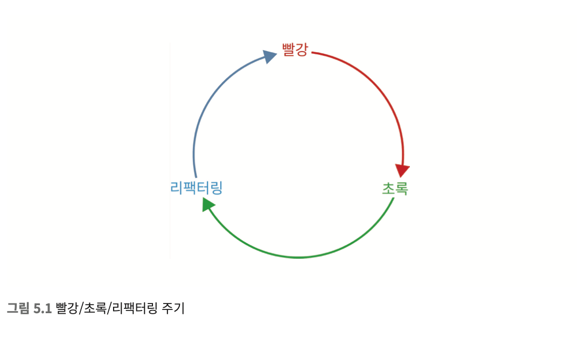

# 기술 실천 방법

프로그래머가 기술적으로 애자일을 실천하기 위한 작업들.
삶의 순환 가장 안쪽의 고리에 대한 설명이다.

## 테스트 주도 개발
### 회계의 복식부기
회계에서는 대변과 차변을 한번에 써 차액을 0으로 맞추는 복식부기가 있다.
TDD 또한 테스트를 작성하고 제품 코드를 작성하여 1:1 구조를 만드는 방식이다.
  
### TDD의 세 가지 규칙
```
* 해당 코드가 없어서 실패하는 테스트 코드를 쓰기 전에 제품 코드를 먼저 쓰면 안 된다
* 테스트 코드를 쓸 때는 실패하도록 만들기 위해 필요한 것보다 더 많이 쓰면 안 된다. 컴파일 실패도 실패로 간주한다.
* 실패하는 테스트를 통과시키기 위해 필요한 코드보다 더 많은 제품 코드를 쓰면 안 된다.
```

테스트코드와 제품 코드를 계속해서 왔다갔다하며 개발을 하는 방법이다. 이런식으로 개발을 한다면, 처음에는 흐름이 끊길수있다.
하지만, 적응이 된다면 작업 단위가 상당히 작게 쪼개져, 조금 더 세밀한 관리가 가능하게 된다.

### 디버깅
TDD를 하게 된다면, 버그 발생 시점이 세분화되어있기 때문에 상대적으로 디버깅에 시간 할애를 안하게 된다.
물론 매번 그럴수는 없겠지만 항상 테스트가 동반되기 때문에 버그의 횟수 자체가 줄어들게 되기도 한다.

### 문서화
API를 제공할 때, 성공과 실패케이스에 대한 테스트 코드 또한 제공하게 된다면 개발자가 조금 더 API를 잘 이해할수 있을것이다.
길고 장황한 설명보다는, 개발자라면 코드를 먼저 보는것에 익숙하기 때문이다.
예제 코드 + 성공과 실패 테스트코드를 보게 하는것 자체가 개발자 문서의 품질을 올려준다.

### 재미
코드를 먼저 작성하고 테스트코드를 작성한다면 이미 개발하면서 간단하게 수동으로 테스트를 거쳤기 때문에 지겨운일이 될 것이다.
하지만 TDD의 경우라면 그런 지겨움이 덜어지고 테스트가 통과될때마다 성취감을 느끼게 된다.

`이건 억지다.`

### 완벽함
배포 결정에 대한 완벽하지 않은, 어느정도의 근거를 만들수 있다.
100%를 추구할수도, 추구할필요도 없다.
TDD를 진행해서 테스트 커버리지또한 90%후반정도면 충분하다.
**하지만 테스트 커버리지를 관리의 지표로 쓸 일은 절대로 없어야 한다.**

`블라디미르 아죠시는 테스트커버리지 자체를 신경쓰지 말라고했다. 90%라는것도 현실적으로는 매우 어려운일인데 TDD라면 가능하다는얘기인가? 이것도 조금 억지같다.`

### 설계
테스트를 진행하다보면, 결국 뭉쳐있는 코드들(지나치게 복잡한 코드)에 부딪히고 고생할수밖에 없는데.. 그래서 수정하게되면 결국 작은 단위로 쪼개져 테스트에도 용이하고, 관리에도 용이해진다.

### 용기
정리가 안되어있는 코드들을 잘못 건드렸다가, 알수없는 오류가 발생할 가능성이 상당히 높지만, 테스트가 내재되고 잘 나뉘어진 코드라면 버그가 발생하여도 작은 단위일 가능성이 크다.
따라서 코드를 수정하는데 부담이 상대적으로 적어진다.

## 리팩터링
### 빨강/초록/리팩터링


TDD의 세 가지 규칙을 반복함으로써 이루어진다.

1. 실패하는 테스트를 만든다
2. 그 테스트를 통과하게 만든다
3. **코드를 정리한다**
4. 1단계로 돌아간다

일단은 테스트 통과에 중점을 두고, 그 이후 코드를 정리한다.

### 더 큰 리팩터링

리팩터링은 상시 업무이지, 정리되지 않은 코드들을 모아서 한번에 작업하는것이 아니다.


## 단순한 설계

```
켄트 백이 세운 단순한 설계의 규칙

1. 모든 테스틀 통과할 것
2. 의도를 드러낼 것
3. 중복을 없앨 것
4. 구성 요소를 줄일 것
```

단순한 설계는 리팩터링의 목표중 하나이며, 이는 TDD와 함께 진행하면 시너지를 낼 수 있다.


### 설계 무게
설계가 복잡해질수록 프로그래머가 느끼는 인지 부하는 늘어난다.
설계가 무거울수록 시스템을 이해하고 수정하기위해 들이는 시간과 노력이 늘어난다.
이미 있는 기능을 바탕으로 적절한 설계를 골라 복잡도를 줄이는것처럼
설계의 복잡도와 기능의 복잡도 사이에서 균형을 잡는것이 단순한 설계의 목표다.


## 짝 프로그래밍
### 짝 프로그래밍이란 무엇인가?
여러명의 사람이 하나의 문제를 함께 해결하는 행위이다.
꼭 두사람일 필요는 없다.
키보드와 마우스를 잡는 운전자(driver)와 항해사(안내자?, navigator)가 있다.

핑퐁을 해서 A가 테스트 작성후 B에게 넘기고 B가 코드작성, 테스트 작성후 A에게 넘겨 반복하는 방식도 있다.

일정을 따로잡지도, 인원을 제한하지도 않는다. 그저 일상적 업무이며, 하나의 개발 기법일 뿐이다.

### 짝 프로그래밍을 하는 이유

팀원끼리 단절되지 않으며, 지식을 더 잘 공유한다

여러명이서 하나의 문제를 놓고 개발을 하기때문에 해결이 더 쉬울수도, 더 나은 설계가 나올수도 있다.

많은 팀에서 코드 리뷰를 짝 프로그래밍으로 대체하였다.

### 짝 프로그래밍을 통한 코드 리뷰
코드리뷰의 한 형태로 볼수도 있겠지만 짝 프로그래밍은 기계적 검사가아니다.
앞으로 어떻게 개발을 해야할지 함께 검토해나갈수 있다.

## 느낀점

내가 TDD를 회의적으로 생각하는 이유중 하나가있는데 그것은 유독 TDD가 자꾸 테스트에 업혀가려고 한다.

인터넷으로 많이 찾아봤을때.. 좀 나쁘게 보면 좋은건 TDD, 안좋은건 테스트의 전반적인 문제.

`우리 TDD 느그 테스트` 같은 늬앙스가 좀 많다 ㅡ,ㅡ

위에 요약한, 책에 설명한 내용들도 대부분 TDD를 `테스트`로 치환해도 가능한부분이 많다.

설계, 문서화, 배포주기 모두 TDD라서 가능한것이 아니다.

테스트가 있어서 가능한것이지.

